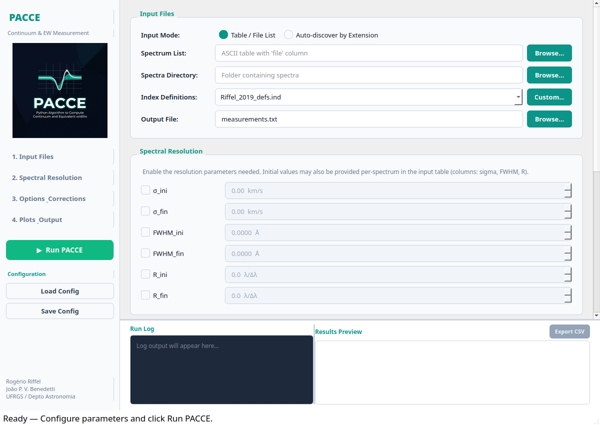

<p align="center">
  
</p>

<h1 align="center">PACCE</h1>

<p align="center">
  <strong>Python Algorithm to Compute Continuum and Equivalent widths</strong>
</p>

This is an updated and upgraded version of the PACCE code ([Riffel & Vale, 2011, Ap&SS, 334, 351](https://ui.adsabs.harvard.edu/abs/2011Ap%26SS.334..351R)) written in Python.

PACCE measures spectral indices (equivalent widths and breaks) while handling the most common corrections to spectra—broadening to a specific resolution, correcting for Doppler shift, etc.—and organizes the results in a `pandas` DataFrame that integrates naturally into Python workflows. This allows the same uniform treatment of both observations and models, degrading them to a common resolution and facilitating direct comparison.

Now includes a modern **PyQt5 Graphical User Interface (GUI)** for interactive workflow configuration and batch processing.

---

## Installation

Install directly from GitHub with `pip`:

```bash
pip install git+https://github.com/rriffel/pacce.git@paccegui
```

### Requirements

- Python ≥ 3.10
- [astropy](https://www.astropy.org/)
- [pandas](https://pandas.pydata.org/)
- [scipy](https://scipy.org/)
- [matplotlib](https://matplotlib.org/)
- [PyQt5](https://pypi.org/project/PyQt5/) (for the graphical interface)

All dependencies are installed automatically by `pip`.

---

## Graphical User Interface (GUI)

PACCE comes with a dedicated desktop graphical interface inspired by modern spectroscopy workflows.

<p align="center">
  
</p>

### Launching the GUI

You can launch the GUI using any of the following methods:

```bash
# 1. Console command (after pip installation)
pacce-gui

# 2. Python module execution
python -m pacce

# 3. From within Python
import pacce
pacce.gui()
```

### Key GUI Features

- **Sidebar Navigation**: Quick jumping between configuration panels, instant execution, and configuration saving/loading.
- **Input Modes**:
  - **Table / File List**: Load a pre-defined table with spectrum filenames and per-spectrum properties (`sigma`, `FWHM`, `R`, `z`).
  - **Auto-discover by Extension**: Select a directory and specify a file extension/pattern (e.g. `.txt`, `.dat`, `*.spec`, `*`). The GUI automatically discovers all matching files and displays a live spectrum count.
- **Spectral Resolution Management**: Freely specify initial and final resolutions in $\sigma$ (km/s), $\text{FWHM}$ (Å), or $R$ ($\lambda/\Delta\lambda$).
- **Physical Validation**: Built-in protection that immediately checks and blocks unphysical convolutions (e.g., attempting to convolve to a higher resolution where $\text{FWHM}_{\text{fin}} < \text{FWHM}_{\text{ini}}$).
- **Options & Corrections**: Interactive toggles for redshift ($z$), Monte Carlo error simulations ($N$), Å-to-magnitude conversions, error propagation, and composite index formulas.
- **Live Logging & Output Table**: Real-time console log and an interactive results preview table with direct CSV export.
- **State Management**: Save and load complete GUI configurations as `.json` files.

---

## Quick Start (Python API)

### 1. Using a Spectrum List Table

```python
from pacce import pacce

# Measure indices from a table listing the spectra
result = pacce(
    filename='spectra_list.dat',        # ASCII table with 'file' column
    path_to_files='./spectra/',         # Directory containing the spectra
    IndexDefs='Riffel_2019_defs.ind',   # Index definitions file
    output_file='measurements.txt'      # Output table
)
```

### 2. Auto-discovering Spectra by Extension (No Table Needed)

You can run PACCE across an entire folder of spectra without creating a list file:

```python
from pacce import pacce

# Automatically find and process all .txt spectra in the directory
result = pacce(
    path_to_files='./spectra/',
    file_extension='.txt',              # e.g., '.txt', '.dat', '*.spec', '*'
    IndexDefs='Riffel_2019_defs.ind',
    output_file='measurements.txt',
    sigma_fin=250.0                     # Convolve all to sigma = 250 km/s
)
```

The returned `result` is a `pandas.DataFrame` containing all measured indices and errors.

---

## Input Parameters

| Parameter | Description |
|---|---|
| `filename` | ASCII table listing 1-D spectra. Must contain a `file` column. Can include per-spectrum columns: `sigma`, `FWHM`, `R`, `z`. *(Optional if `file_extension` is used)* |
| `path_to_files` | Directory containing the spectra. Default: `'./'`. |
| `file_extension` | Pattern or extension to auto-discover spectra when `filename` is not provided (e.g., `'.txt'`, `'.dat'`, `'*.spec'`, `'*'`). |
| `IndexDefs` | Path to the index definitions file (`.ind`). |
| `output_file` | Path for saving the output measurements table. Default: `'demo.txt'`. |
| `sigma_ini` / `sigma_fin` | Initial / final velocity dispersion ($\text{km/s}$) for convolution. |
| `FWHM_ini` / `FWHM_fin` | Initial / final FWHM ($\text{Å}$) for convolution. |
| `R_ini` / `R_fin` | Initial / final resolving power $R = \lambda/\Delta\lambda$. |
| `z` | Global redshift correction to apply before measuring. |
| `simulate` | Number of Monte Carlo iterations for error estimation. |
| `error` | If `True`, utilizes the error spectrum (3rd column) for analytical uncertainties. |
| `negative_Ew_to_zero` | If `True`, sets negative equivalent width measurements to zero. |
| `A_to_mag` | List of index names to convert from $\text{Å}$ to magnitudes (e.g. `['Mg1', 'Mg2']`). |
| `compute_idx` | Path to a text file containing composite index expressions (e.g. `MgFe'`), one per line. |
| `print_log` | Path to a text file to redirect standard output log. |
| `path_singleind_plots` | Directory for saving individual diagnostic index plots. |
| `AllIndicesPlot` | Filename for saving a combined multi-panel index plot (e.g. `'all_indices.png'`). |
| `allindices_plot_path` | Directory for saving the combined multi-panel plot. |

---

## Resolution Mixing & Validation

The resolution parameters (`sigma`, `FWHM`, `R`) can be mixed freely—for example, providing `FWHM_ini` together with $\sigma_{\text{fin}}$, or $R_{\text{ini}}$ with $\sigma_{\text{fin}}$.

PACCE converts all resolution units internally into wavelength-dependent $\text{FWHM}(\lambda)$ in Ångströms:
- **From $\sigma$ (km/s)**: $\text{FWHM}(\lambda) = \left(\frac{\sigma \cdot 2.355}{c}\right) \cdot \lambda$
- **From $R$ ($\lambda/\Delta\lambda$)**: $\text{FWHM}(\lambda) = \frac{\lambda}{R}$

### Physical Validation
Spectral convolution can only **degrade/broaden** resolution. PACCE automatically validates resolution settings both in the Python API and the GUI:
- If target resolution is higher than initial resolution ($\text{FWHM}_{\text{fin}} < \text{FWHM}_{\text{ini}}$, $\sigma_{\text{fin}} < \sigma_{\text{ini}}$, or $R_{\text{fin}} > R_{\text{ini}}$), the code raises a clear `ValueError` and the GUI blocks execution with a detailed warning.

---

## Index Definitions File

The definitions file is pipe-delimited (`|`) with four columns:

```
# Name     Line                    RedCont                BlueCont                Ref.
Mgb  |  5160.1250-5192.6250  |  5142.6250-5161.3750, 5191.3750-5206.3750  |  (Trager+98)
```

- **Name**: Index identifier
- **Line**: Wavelength range of the feature (set both limits equal for a break index)
- **Continuum bands**: Comma-separated pairs of wavelength ranges for the continuum fit
- **Ref.**: Literature reference

Pre-configured definition files are bundled in `pacce/suport_files/` (`Riffel_2019_defs.ind`, `less_defs.ind`).

---

## Error Handling

PACCE supports two approaches for error estimation:

1. **Analytical (default when error spectrum exists)**: Estimates errors from the S/N ratio in the feature and continuum bands using the formalism of [Cardiel et al. (2006)](https://arxiv.org/abs/astro-ph/0606341).
2. **Monte Carlo (`simulate=N`)**: Generates $N$ synthetic spectra from the observed spectrum and error array, re-measures the indices, and derives the uncertainty from the standard deviation.

---

## Variable-Sigma Convolution

PACCE performs spectral convolution with a variable-sigma Gaussian kernel using the Fourier-space algorithm described in [Cappellari (2022)](https://ui.adsabs.harvard.edu/abs/2022arXiv220814974C). This handles wavelength-dependent resolution differences properly, including error propagation following [Klein (2021)](https://ui.adsabs.harvard.edu/abs/2021RNAAS...5...39K).

---

## Examples

Two Jupyter notebooks are provided in the repository:

- **`Examples.ipynb`** — Demonstrates the full API: basic index measurement, spectral convolution, magnitude conversion, composite indices, MC error estimation, and diagnostic plotting.
- **`Models_and_obs.ipynb`** — Practical use case: measuring indices in SDSS spectra and E-MILES models at a common resolution, then deriving ages and metallicities via grid interpolation.

---

## Project Structure

```
pacce/
├── pacce/
│   ├── __init__.py              # Package entry point (exports pacce, PacceFunctions, and gui())
│   ├── __main__.py              # CLI launcher (python -m pacce)
│   ├── PacceFunctions.py        # Core algorithms (eqw, varsmooth, plotting, etc.)
│   ├── pacce_wapper.py          # High-level wrapper function (table & auto-discovery)
│   ├── pacce_run.py             # Example script
│   ├── assets/                  # Branding and UI assets (logo.jpg)
│   ├── gui/                     # PyQt5 Graphical Interface
│   │   ├── __init__.py
│   │   ├── constants.py         # UI themes and styling
│   │   ├── custom_widgets.py    # Reusable controls & console
│   │   └── main_gui.py          # Main application window & background worker
│   ├── suport_files/            # Index definitions and spectral resolution data
│   └── examples/                # SDSS spectra, MILES models, and example tables
├── Examples.ipynb               # Tutorial notebook
├── Models_and_obs.ipynb         # Models vs. observations notebook
├── pyproject.toml               # Build configuration and console scripts
├── setup.py                     # Setup script
└── README.md
```

---

## Citation

If you use PACCE in your research, please cite:

> Riffel, R. & Vale, T. B., 2011, Ap&SS, 334, 351

---

## License

This project is open source. See the repository for details.
